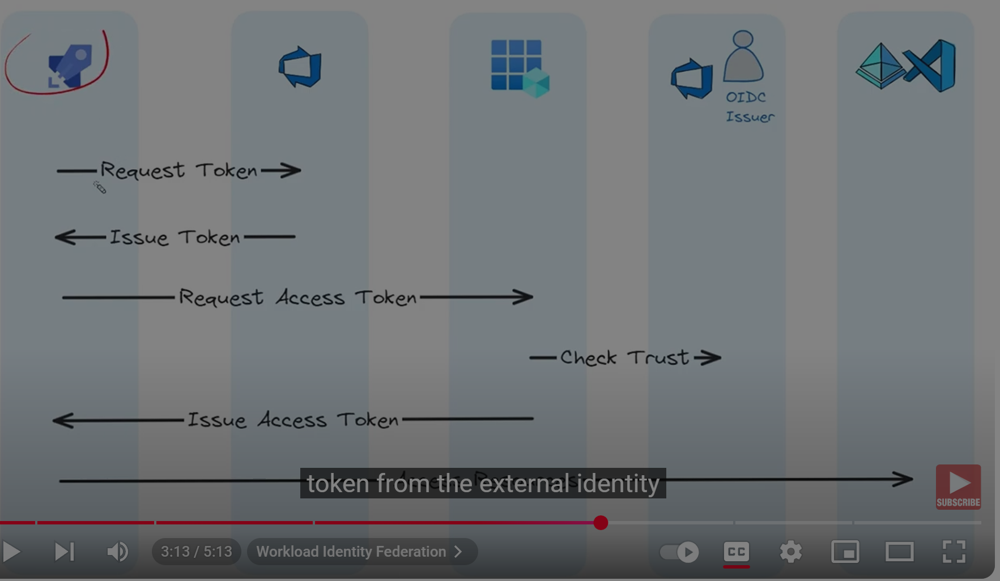

# Workload Identity Federation

Workload Identity Federation is a security feature provided by cloud providers like Google Cloud Platform (GCP) that allows workloads (such as applications, virtual machines, or containers) running outside of the cloud environment to securely access cloud resources without the need to manage or store long-lived service account keys.

Typically, a software workload (such as an applicaiton )

Key Concepts:

* Workload: Any application, service, or process that runs in a non-cloud environment (e.g., on-premises data centers, other cloud platforms, or developer laptops).

* Identity Federation: A mechanism that allows external identities (e.g., from other identity providers like AWS, Azure, or on-premises systems) to be trusted and used to access cloud resources.

* Short-Lived Credentials: Instead of using long-lived service account keys, Workload Identity Federation issues short-lived access tokens, reducing the risk of key exposure or misuse.

## How It Works:

1. Trust Relationship: You establish a trust relationship between your cloud provider (e.g., GCP) and an external identity provider (e.g., AWS IAM, GitHub, or an on-premises system).

2. Token Exchange: The external workload authenticates with its identity provider and receives a token. This token is then exchanged for a short-lived cloud access token.

3. Access Cloud Resources: The workload uses the short-lived token to access cloud resources, such as storage buckets, databases, or APIs, without needing to store long-lived credentials.

## Example: Azure Workload Identity Federation

 Let's take Azure DevOps use Workload Identity Federation (also known as Federated Identity Credentials) to securely access Azure resources without needing to store or manage long-lived secrets like service principal credential secret

 Key Components:

1. Azure Service Principal: An identity in Azure Active Directory (Azure AD) that represents the application or workload, (in our example - azure Devops pipeline).

2. Federated Identity Credential: A trust relationship between the Azure service principal and an external identity provider (e.g., Azure DevOps).

3. OIDC (OpenID Connect): The protocol used to exchange tokens between Azure DevOps and Azure AD.



The authentication flow is:

1. Wokeload - Azure Devops pipeline request token from identity provider - Azure DevOps

2. Azure Devops issue token 

3. Azure Devops pipeline send token to microsoft identity platform and request access token

4. Microsoft identity platform checks the trust relationship on the app registration and validate the external token against the openID connect issuer URL, when the checks are satisfied, the Microsoft identity platform issues an access token to the external workload.

5. The azure devops pipelines use the access token to create resources in Azure

## Steps to Set Up Workload Identity Federation for Azure DevOps:

1. Create an Azure Service Principal

* Create a service principal in Azure AD that represents the workload.

* Assign the necessary Azure role-based access control (RBAC) permissions to the service principal for the resources it needs to access.

2. Configure Federated Identity Credentials

* In the Azure portal or using Azure CLI, create a federated identity credential for the service principal.

* Link the service principal to the external identity provider (Azure DevOps) by specifying:

Issuer URL: The OIDC issuer URL for Azure DevOps (e.g., https://vstoken.dev.azure.com/<organization-id>).

Subject: A unique identifier for the Azure DevOps pipeline (e.g., repo:<organization>/<project>:ref:refs/heads/<branch>).

3. Configure Azure DevOps Pipeline

In your Azure DevOps pipeline YAML file, use the AzureCLI or AzurePowerShell task to authenticate using the federated identity.

Specify the service principal and tenant ID in the pipeline configuration.

```
trigger:
- main

pool:
  vmImage: 'ubuntu-latest'

steps:
- task: AzureCLI@2
  inputs:
    azureSubscription: '<service-connection-name>'
    scriptType: 'bash'
    scriptLocation: 'inlineScript'
    inlineScript: |
      az login --service-principal -u <client-id> -t <tenant-id> --federated-token $(System.AccessToken)
      az account show
```

4. Grant Permissions to the Service Principal
Ensure the service principal has the necessary permissions to access the Azure resources required by the pipeline.

5. Run the Pipeline
When the pipeline runs, Azure DevOps will exchange its OIDC token for an Azure AD access token, which is then used to authenticate and authorize access to Azure resources.
