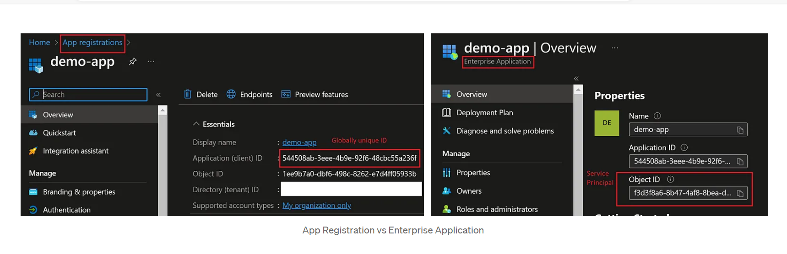

# What are Azure App Registration, Enterprise Apps, and Service Principle

If you use Microsoft Identity Platform (AAD) to provide authentication and Authorization for your apps, you must follow the App Registration process. After success registration, it enables the trust between your app and identity platform (AAD)

[Simple Start to register your app](https://learn.microsoft.com/en-us/entra/identity-platform/quickstart-register-app?tab=certificate&tabs=certificate)

After successful registration of your app, you will notice the app is created in 2 places - "App Registrations" and "Enterprise Applications". It created a globally unique identifier - Application (client) ID in Application Registration and a local Service Principle object with the same name in the Enterprise Applications

Why do we need a local Service principle and global app registray? 

## App Registrations

Apps under "App Registrations" represent the actual application object, this is the place where you set the authentications and authorization of your app. For instance, under app registration, you can set:

1. scope:Which APIs should your app interact with
2. Application Permissions or Delegated Permissions
3. Client secrets or certificates

## Enterprise Application

For a single-tenant application, an Enterprise App with the same name is automatically created once you register an application.

The Configurations that you have set for your app under App Registrations are referenced by your Enterprise Application. Enterprise Apps is all about how your app should behave and work in your local tenant. It is up to the administrator of your orgnization to control the settings of your app 

Enterprise apps mainly focuses on:

1. Consent tracking.
2. Scope / API permission management 
3. Management

## Service principle

Service principle is nothing but your Enterprise Applications